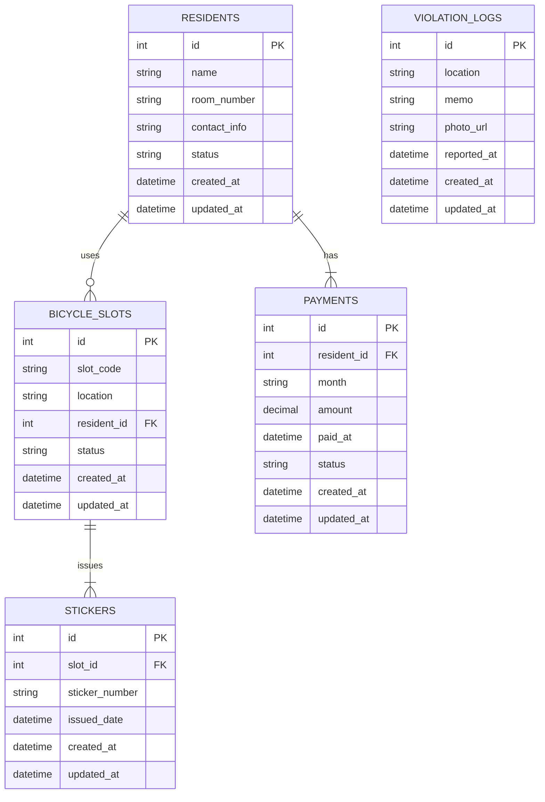

# 🚲 マンション共同駐輪場管理Webアプリケーション 要件定義（最終版）

---

## 1. 🎯 ゴール定義（Goal Definition）

### ■ ビジネスゴール

- 管理人が、マンションの居住者の駐輪場利用状況を把握し、申し込みがあった際の **駐輪枠割り当て** や **入金対象者の管理** ができるようにする。  
- 居住者がどの自転車を置いているかまでは管理しない。**個別の自転車情報は管理対象外**とし、駐輪枠そのものと居住者の利用状況にフォーカスする。

---

## 2. 🧾 ユースケース一覧

下記のユースケースは **「管理人専用システム」** を前提にしたものです。

| UC番号 | ユースケース名                         | 概要                                                         |
|--------|----------------------------------------|--------------------------------------------------------------|
| UC2    | 駐輪枠割り当て・ステッカー発行         | 管理人が申し込み済みの居住者に空き枠を割り当て、ステッカーを発行する |
| UC4    | 駐輪枠削除・退去処理                   | 管理人が退去者や利用終了者の割り当てを解除する                     |
| UC6    | 不正利用記録                           | 管理人が無登録利用などを現地で確認し、記録する                     |
| UC7    | 利用者管理                             | 管理人が居住者情報を登録・編集し、枠との紐付けを行う               |
| UC8    | 入金対象者抽出                         | 駐輪場利用者のうち、入金が必要な対象を抽出する                     |

> **Note**  
> UC1や「自転車登録」自体は削除し、個別自転車の詳細管理は行いません。

---

## 3. 🔧 ロバストネス分析

### 3.1. UC2. 駐輪枠割り当て・ステッカー発行

- **アクター（Actor）**：管理人  
- **境界オブジェクト（Boundary）**：割り当て＋ステッカー発行画面  
- **制御オブジェクト（Control）**：`SlotAssignmentAndStickerController`  
- **エンティティ（Entity）**：
  - `Resident`（申込者）
  - `BicycleSlot`（空き枠）
  - `Sticker`（発行情報）

#### フロー
1. 管理人が申込者一覧から居住者を選択  
2. 空き枠一覧を表示 → 1枠を選択して割り当て  
3. 割り当てと同時にステッカー番号・発行日などを入力  
4. システムは以下を実行：
   - `bicycle_slots.resident_id` に居住者を紐付け（ステータス「使用中」に）  
   - `stickers` テーブルに発行記録を作成

---

### 3.2. UC4. 駐輪枠削除・退去処理

- **アクター**：管理人  
- **境界**：枠管理画面  
- **制御**：`SlotReleaseController`  
- **エンティティ**：
  - `BicycleSlot`

#### フロー
1. 使用中の枠を検索  
2. 退去や利用終了に伴い、割り当てを解除  
3. `bicycle_slots.resident_id` を `NULL` に更新／ステータスを「空き」に戻す

---

### 3.3. UC6. 不正利用記録

- **アクター**：管理人  
- **境界**：不正記録フォーム  
- **制御**：`ViolationLogController`  
- **エンティティ**：
  - `ViolationLog`（場所、日付、メモ、写真等）

#### フロー
1. 管理人が現地で無登録利用等を確認  
2. 不正利用フォームに、場所や備考、写真などを入力して登録  
3. `violation_logs` に記録として保存

---

### 3.4. UC7. 利用者管理

- **アクター**：管理人  
- **境界**：居住者管理画面  
- **制御**：`ResidentController`  
- **エンティティ**：
  - `Resident`

#### フロー
1. 居住者一覧を参照／検索  
2. 新規登録・編集・削除  
3. 各居住者が使用中の枠情報（`bicycle_slots`）も参照

---

### 3.5. UC8. 入金対象者抽出

- **アクター**：管理人  
- **境界**：入金管理画面  
- **制御**：`PaymentExtractionController`  
- **エンティティ**：
  - `Payment`
  - `Resident`
  - `BicycleSlot`

#### フロー
1. 当月利用中 or 未払の利用者を抽出  
2. 画面 or CSVで出力  
3. 必要に応じて一括請求フローへ

---

## 4. 🗂 クラス分類（概略）

| クラス名                               | 種別       | 概要                                                        |
|----------------------------------------|------------|-------------------------------------------------------------|
| `Resident`                             | Entity     | 居住者情報（氏名、部屋番号、連絡先など）                    |
| `BicycleSlot`                          | Entity     | 駐輪枠（固定ID、物理的位置、割り当て状況、紐付け居住者など） |
| `Sticker`                              | Entity     | ステッカー発行履歴（割り当て日時、ステッカー番号など）        |
| `ViolationLog`                         | Entity     | 不正利用記録（日時、場所、写真URLなど）                      |
| `Payment`                              | Entity     | 入金管理（利用者ID、月、金額、支払い日など）                |
| `SlotAssignmentAndStickerController`   | Control    | 駐輪枠割り当て・ステッカー発行処理                          |
| `SlotReleaseController`                | Control    | 駐輪枠削除・退去処理                                        |
| `ViolationLogController`               | Control    | 不正利用記録を登録・参照する処理                            |
| `ResidentController`                   | Control    | 居住者の管理（登録・編集・削除）                            |
| `PaymentExtractionController`          | Control    | 入金対象者を抽出する処理                                    |
| `SlotAssignmentView`                   | Boundary   | 割り当て・ステッカー発行画面                                |
| `SlotManagementView`                   | Boundary   | 駐輪枠一覧・退去処理画面                                    |
| `ViolationLogForm`                     | Boundary   | 不正記録登録画面                                            |
| `ResidentManagementView`               | Boundary   | 居住者一覧・編集画面                                        |
| `PaymentManagementView`                | Boundary   | 入金情報一覧・抽出画面                                      |

---

## 5. 📝 非機能・補足要件

- **認証**：管理者ログイン（例：Firebase AuthやJWT認証）  
- **UIデバイス**：PCまたはタブレット対応  
- **操作ログ**：割り当て、解除、ステッカー発行、不正記録などの操作履歴を保持  
- **バックアップ**：定期的なDBバックアップ  
- **CSV出力**：入金対象や枠利用一覧をCSVでエクスポート可能

---

## 6. 🗺 ER図（Mermaid記法）

